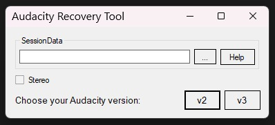

# Audacity Recovery Tool

I made this project to recover a recording made with audacity.

When you record something in audacity there is a chance that the program will crash and you will lose the recording, luckily audacity saves the audio in temporary .au files, this simple python script should reorder these files and delete duplicates.

## New Version
- Added a new user interface to make the process easier.
- Added support for both versions **2.x.x** and **3.x.x**

## Warning

- This program has been successfully tested in various versions of audacity, even so we do not guarantee that it will work in your version.

## How to Use

Select the folder SessionData, this folder is usually located at ***C:/Users/User/AppData/Local/audacity/SessionData***

Then select your version of audacity and wait for the process to finish.

Once the process is finished you will see a folder on your desktop called 'Recovered'

**Enjoy!**